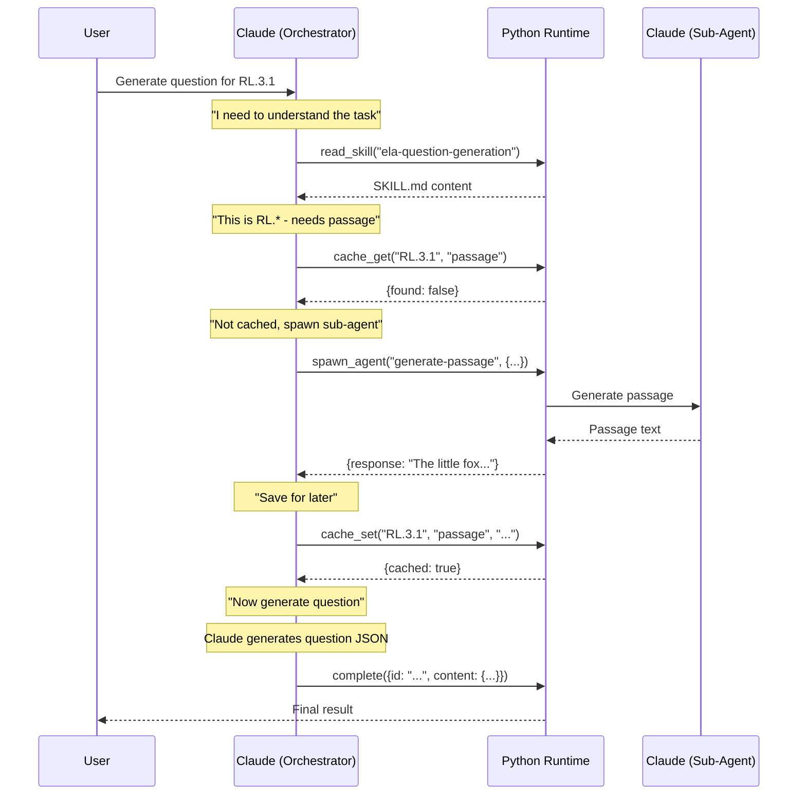

# ELA Question Generation SDK v2

Generate K-12 ELA assessment questions using **SKILL.md files as the single source of truth**.

## Architecture Modes

This SDK supports **two architecture modes**:

| Mode | File | Who Orchestrates | Best For |
|------|------|------------------|----------|
| **Python Orchestrator** | `agentic_pipeline.py` | Python controls flow | Production, predictable |
| **Claude Orchestrator** | `agentic_pipeline_orchestrator.py` | Claude controls flow | Flexible, adaptive |

### Recommended: Claude as Orchestrator

The **Claude Orchestrator** mode gives Claude full control over the workflow. Claude decides what skills to read, when to spawn sub-agents, and when the task is complete.



### Meta-Tools (Claude's Capabilities)

When Claude is the orchestrator, Python provides these **meta-tools**:

| Tool | Purpose | Example |
|------|---------|---------|
| `read_skill(name)` | Load a SKILL.md file | `read_skill("ela-question-generation")` |
| `spawn_agent(skill, msg)` | Spawn a sub-agent | `spawn_agent("generate-passage", {...})` |
| `cache_get(key, type)` | Check cache | `cache_get("RL.3.1", "passage")` |
| `cache_set(key, type, val)` | Save to cache | `cache_set("RL.3.1", "passage", "...")` |
| `complete(result)` | Finish and return | `complete({id: "...", content: {...}})` |

### Why Claude as Orchestrator?

```
┌─────────────────────────────────────────────────────────────────────────────┐
│                     CLAUDE AS ORCHESTRATOR                                   │
├─────────────────────────────────────────────────────────────────────────────┤
│                                                                             │
│  Traditional (Python orchestrates):                                         │
│    Python Loop ──► Claude Turn ──► Python executes ──► Claude Turn          │
│    (Python decides when to loop, what tools to call)                        │
│                                                                             │
│  New (Claude orchestrates):                                                 │
│    Claude ──► read_skill() ──► spawn_agent() ──► cache_set() ──► complete() │
│    (Claude decides everything, Python just provides capabilities)           │
│                                                                             │
│  Benefits:                                                                  │
│    ✓ Claude has full control over workflow                                  │
│    ✓ More flexible and adaptive                                             │
│    ✓ Claude can reason about what to do next                                │
│    ✓ Easy to add new capabilities as tools                                  │
│                                                                             │
└─────────────────────────────────────────────────────────────────────────────┘
```

## Architecture (Detailed)

```
┌─────────────────────────────────────────────────────────────────────────────┐
│                           SDK v2 ARCHITECTURE                                │
├─────────────────────────────────────────────────────────────────────────────┤
│                                                                             │
│  SINGLE SOURCE OF TRUTH: .claude/skills/*/SKILL.md                          │
│                                                                             │
│  ┌─────────────────────────────────────────────────────────────────────┐   │
│  │  ela-question-generation/SKILL.md                                   │   │
│  │    - Question generation instructions                               │   │
│  │    - Output formats (MCQ, MSQ, Fill-in)                            │   │
│  │    - Quality checklist                                              │   │
│  │    - Loaded as SYSTEM PROMPT by SDK                                 │   │
│  └─────────────────────────────────────────────────────────────────────┘   │
│                                                                             │
│  ┌─────────────────────────────────────────────────────────────────────┐   │
│  │  generate-passage/SKILL.md                                          │   │
│  │    - Passage generation instructions                                │   │
│  │    - Grade-level guidelines                                         │   │
│  │    - Used by generate_passage TOOL via SDK                          │   │
│  └─────────────────────────────────────────────────────────────────────┘   │
│                                                                             │
└─────────────────────────────────────────────────────────────────────────────┘
```

## Key Differences from v1

| Aspect | v1 | v2 (This) |
|--------|-----|-----------|
| Instructions | Hardcoded in Python | SKILL.md files |
| Curriculum tools | Inline during generation | Separate endpoint (pre-populate) |
| Passage generation | Python script + API | Sub-agent reads SKILL.md |
| Single source of truth | No (duplicated) | Yes (SKILL.md) |
| Deployment | Single endpoint | Multiple endpoints |

## Skills

| Skill | SKILL.md | Used By | Purpose |
|-------|----------|---------|---------|
| `ela-question-generation` | System prompt for main agent | `/generate` | Question generation instructions |
| `generate-passage` | System prompt for sub-agent | `generate_passage` tool | Passage generation for RL/RI |
| `populate-curriculum` | System prompt for sub-agent | `/populate-curriculum` | Curriculum data generation |

### How Skills Work

1. **Python loads SKILL.md** as system prompt
2. **Claude reads the skill** and follows its instructions
3. **No hardcoded prompts** in Python code
4. **Update SKILL.md** to change behavior (single source of truth)

## Detailed Workflow

### What Happens After SKILL.md is Loaded

```
┌─────────────────────────────────────────────────────────────────────────────┐
│                         FULL GENERATION FLOW                                 │
├─────────────────────────────────────────────────────────────────────────────┤
│                                                                             │
│  1. USER runs: python scripts/generate_batch.py                             │
│                              ↓                                              │
│  2. SDK loads ela-question-generation/SKILL.md as SYSTEM PROMPT             │
│                              ↓                                              │
│  3. SDK sends request to Claude via Anthropic API                           │
│     - System: SKILL.md content                                              │
│     - User: Request JSON (standard, grade, type, difficulty)                │
│     - Tools: [generate_passage]                                             │
│                              ↓                                              │
│  4. CLAUDE reads SKILL.md instructions and decides:                         │
│                                                                             │
│     ┌─────────────────────────────────────────────────────────────────┐    │
│     │ Is this RL.* or RI.* standard?                                  │    │
│     │   YES → Call generate_passage tool                              │    │
│     │   NO  → Skip to question generation                             │    │
│     └─────────────────────────────────────────────────────────────────┘    │
│                              ↓                                              │
│  5. IF generate_passage tool called:                                        │
│     ┌─────────────────────────────────────────────────────────────────┐    │
│     │ SDK executes generate_passage:                                  │    │
│     │   a. Check cache (data/passages/{standard}.json)                │    │
│     │   b. If cached → return cached passage                          │    │
│     │   c. If not cached:                                             │    │
│     │      - Load generate-passage/SKILL.md as system prompt          │    │
│     │      - Call Anthropic SDK to generate passage                   │    │
│     │      - Save to cache                                            │    │
│     │      - Return passage text to Claude                            │    │
│     └─────────────────────────────────────────────────────────────────┘    │
│                              ↓                                              │
│  6. CLAUDE generates question:                                              │
│     - Uses SKILL.md output format                                           │
│     - Anchors to passage (if RL/RI)                                         │
│     - Returns JSON                                                          │
│                              ↓                                              │
│  7. SDK extracts JSON and saves to outputs/                                 │
│                                                                             │
└─────────────────────────────────────────────────────────────────────────────┘
```

### File Responsibilities

| File | What It Does |
|------|--------------|
| `.claude/skills/ela-question-generation/SKILL.md` | Instructions for Claude on how to generate questions. Loaded as system prompt. |
| `.claude/skills/generate-passage/SKILL.md` | Instructions for passage generation. Used by `generate_passage` tool. |
| `src/agentic_pipeline.py` | SDK orchestration: loads skills, defines tools, calls Anthropic API. |
| `scripts/generate_batch.py` | CLI entry point for batch generation. |
| `data/passages/` | Cache for generated passages (JSON files). |
| `data/benchmark.jsonl` | Input requests for batch generation. |
| `outputs/` | Generated questions output. |

### Tool Execution: Sub-Agent Architecture

**Key principle**: No hardcoded prompts in Python. Tools spawn **sub-agents** that read their own SKILL.md.

```
┌─────────────────────────────────────────────────────────────────────────────┐
│                      generate_passage TOOL = SUB-AGENT                       │
├─────────────────────────────────────────────────────────────────────────────┤
│                                                                             │
│  MAIN AGENT (ela-question-generation/SKILL.md)                              │
│    │                                                                        │
│    │ Claude reads SKILL.md, decides: "This is RL.3.1, I need a passage"     │
│    │                                                                        │
│    ▼                                                                        │
│  Claude calls: generate_passage(standard_id, grade, style)                  │
│                              ↓                                              │
│  ┌─────────────────────────────────────────────────────────────────────┐   │
│  │ TOOL EXECUTION (spawns SUB-AGENT)                                   │   │
│  │                                                                     │   │
│  │   1. Check cache: data/passages/{standard_id}.json                  │   │
│  │      → If exists: return cached passage (no sub-agent needed)       │   │
│  │                                                                     │   │
│  │   2. SPAWN SUB-AGENT:                                               │   │
│  │      ┌───────────────────────────────────────────────────────────┐ │   │
│  │      │ SUB-AGENT (generate-passage/SKILL.md)                     │ │   │
│  │      │                                                           │ │   │
│  │      │  System: generate-passage/SKILL.md  ← Claude reads this   │ │   │
│  │      │  User: {"standard_id": "...", "grade": "3", "style": "..."} │ │   │
│  │      │                                                           │ │   │
│  │      │  Claude (sub-agent) follows SKILL.md instructions:        │ │   │
│  │      │    - Reads grade-level guidelines                         │ │   │
│  │      │    - Generates appropriate passage                        │ │   │
│  │      │    - Returns passage text                                 │ │   │
│  │      └───────────────────────────────────────────────────────────┘ │   │
│  │                                                                     │   │
│  │   3. Cache the passage                                              │   │
│  │   4. Return passage_text to MAIN AGENT                              │   │
│  └─────────────────────────────────────────────────────────────────────┘   │
│                              ↓                                              │
│  MAIN AGENT receives passage → creates passage-based question               │
│                                                                             │
└─────────────────────────────────────────────────────────────────────────────┘
```

### Why Sub-Agents?

| Approach | Problem |
|----------|---------|
| Python hardcodes prompt | Duplicates SKILL.md, drifts over time |
| **Sub-agent reads SKILL.md** | Single source of truth, Claude decides everything |

The Python code only:
1. Checks cache
2. Spawns sub-agent with SKILL.md as system prompt
3. Passes minimal request context
4. Caches and returns result

**Claude (sub-agent) does all the reasoning** based on SKILL.md.

### Passage Generation Flow (Detailed)

```
┌─────────────────────────────────────────────────────────────────────────────┐
│                        PASSAGE GENERATION FLOW                               │
├─────────────────────────────────────────────────────────────────────────────┤
│                                                                             │
│  1. MAIN AGENT starts                                                       │
│     System: ela-question-generation/SKILL.md                                │
│     User: "Generate question for RL.3.1..."                                 │
│                              ↓                                              │
│  2. CLAUDE reads SKILL.md and decides:                                      │
│     "This is RL.* standard → I need a passage first"                        │
│                              ↓                                              │
│  3. CLAUDE calls tool: generate_passage(standard_id, grade, style)          │
│                              ↓                                              │
│  4. TOOL HANDLER executes:                                                  │
│     ┌─────────────────────────────────────────────────────────────────┐    │
│     │ async def generate_passage_handler(inputs, agent):              │    │
│     │                                                                 │    │
│     │   a. Check cache: PassageCache().get(standard_id)               │    │
│     │      → If found: return cached passage immediately              │    │
│     │                                                                 │    │
│     │   b. Load skill: load_skill("generate-passage")                 │    │
│     │      → Reads .claude/skills/generate-passage/SKILL.md           │    │
│     │                                                                 │    │
│     │   c. SPAWN SUB-AGENT (simple call, no tools):                   │    │
│     │      passage_text = await agent.simple_call(skill, user_msg)    │    │
│     │                                                                 │    │
│     │   d. Cache result: cache.set(standard_id, passage_text)         │    │
│     │      → Saves to data/passages/{standard_id}.json                │    │
│     │                                                                 │    │
│     │   e. Return: {"success": True, "passage_text": "..."}           │    │
│     └─────────────────────────────────────────────────────────────────┘    │
│                              ↓                                              │
│  5. MAIN AGENT receives passage → creates question based on it              │
│                                                                             │
└─────────────────────────────────────────────────────────────────────────────┘
```

| Step | Who | What |
|------|-----|------|
| 1 | Main Agent | Reads `ela-question-generation/SKILL.md`, decides passage needed |
| 2 | Main Agent | Calls `generate_passage` tool |
| 3 | Tool Handler | Checks cache first |
| 4 | Tool Handler | Loads `generate-passage/SKILL.md` |
| 5 | **Sub-Agent** | Claude reads SKILL.md, generates passage |
| 6 | Tool Handler | Caches passage, returns to Main Agent |
| 7 | Main Agent | Uses passage to create question |

## Directory Structure

```
agent_sdk_v2/
├── .claude/
│   └── skills/
│       ├── ela-question-generation/
│       │   └── SKILL.md              # Question generation instructions
│       ├── generate-passage/
│       │   └── SKILL.md              # Passage generation instructions
│       └── populate-curriculum/
│           └── SKILL.md              # Curriculum population instructions
├── src/
│   ├── __init__.py
│   ├── agentic_pipeline.py           # Python orchestrator (traditional)
│   ├── agentic_pipeline_v3.py        # Clean SDK pattern (refactored)
│   ├── agentic_pipeline_orchestrator.py  # ⭐ Claude as orchestrator (recommended)
│   ├── curriculum_pipeline.py        # Curriculum population pipeline
│   └── main.py                       # FastAPI with all endpoints
├── scripts/
│   ├── generate_batch.py             # CLI for batch generation
│   └── deploy.sh                     # Cloud Run deployment
├── data/
│   ├── benchmark.jsonl               # Input requests
│   ├── curriculum.md                 # Curriculum data (populated)
│   └── passages/                     # Passage cache
├── outputs/                          # Generated questions
├── Dockerfile
├── cloudbuild.yaml
├── requirements.txt
├── .env.example
└── README.md
```

### Pipeline Files Comparison

| File | Architecture | Who Orchestrates | Use Case |
|------|--------------|------------------|----------|
| `agentic_pipeline.py` | Traditional loop | Python | Original implementation |
| `agentic_pipeline_v3.py` | Clean classes | Python | Refactored, modular |
| `agentic_pipeline_orchestrator.py` | Meta-tools | **Claude** | Recommended, flexible |

## Quick Start

```bash
# 1. Setup
cd agent_sdk_v2
python -m venv venv
source venv/bin/activate  # or venv\Scripts\activate on Windows
pip install -r requirements.txt

# 2. Configure
cp .env.example .env
# Edit .env and add your ANTHROPIC_API_KEY

# 3. Start server
python src/main.py --serve

# 4. Test endpoints (in another terminal)
curl http://localhost:8080/

# Generate question
curl -X POST http://localhost:8080/generate \
  -H "Content-Type: application/json" \
  -d '{"skills": {"substandard_id": "CCSS.ELA-LITERACY.L.3.1.A"}}'

# Populate curriculum
curl -X POST http://localhost:8080/populate-curriculum \
  -H "Content-Type: application/json" \
  -d '{"standard_id": "CCSS.ELA-LITERACY.L.3.1.A", "standard_description": "Explain the function of nouns..."}'
```

## API Endpoints

| Endpoint | Method | Description |
|----------|--------|-------------|
| `/` | GET | Health check |
| `/generate` | POST | Generate ELA question |
| `/populate-curriculum` | POST | Populate curriculum for a standard |
| `/populate-curriculum/batch` | POST | Populate curriculum for multiple standards |

### POST /generate

Generate an ELA question (MCQ, MSQ, Fill-in).

```json
{
  "grade": "3",
  "type": "mcq",
  "difficulty": "medium",
  "skills": {
    "substandard_id": "CCSS.ELA-LITERACY.L.3.1.A",
    "substandard_description": "Explain the function of nouns..."
  }
}
```

### POST /populate-curriculum

Pre-populate curriculum data before question generation.

```json
{
  "standard_id": "CCSS.ELA-LITERACY.L.3.1.A",
  "standard_description": "Explain the function of nouns, pronouns, verbs...",
  "grade": "3",
  "force": false
}
```

Response:
```json
{
  "success": true,
  "standard_id": "CCSS.ELA-LITERACY.L.3.1.A",
  "source": "generated_by_subagent",
  "curriculum_data": {
    "learning_objectives": [...],
    "assessment_boundaries": [...],
    "common_misconceptions": [...]
  },
  "saved_to_file": true
}
```

## Input Format

Create `data/benchmark.jsonl` with one request per line:

```jsonl
{"type": "mcq", "grade": "3", "difficulty": "easy", "skills": {"substandard_id": "CCSS.ELA-LITERACY.L.3.1.A", "substandard_description": "Explain the function of nouns..."}}
{"type": "mcq", "grade": "3", "difficulty": "medium", "skills": {"substandard_id": "CCSS.ELA-LITERACY.RL.3.1", "substandard_description": "Ask and answer questions..."}}
```

## Output Format

```json
{
  "generated_content": [
    {
      "id": "l_3_1_a_mcq_easy_001",
      "content": {
        "answer": "B",
        "question": "Which word is a noun?",
        "image_url": [],
        "answer_options": [...],
        "answer_explanation": "..."
      },
      "request": {...}
    }
  ],
  "metadata": {
    "total": 5,
    "success": 5,
    "tool_calls": {"generate_passage": 2}
  }
}
```

## Deployment

### Local

```bash
python src/main.py --serve --port 8080
```

### Docker

```bash
docker build -t ela-sdk-v2 .
docker run -p 8080:8080 -e ANTHROPIC_API_KEY=sk-... ela-sdk-v2
```

### Google Cloud Run

```bash
# Make deploy script executable
chmod +x scripts/deploy.sh

# Deploy (requires gcloud CLI configured)
./scripts/deploy.sh
```

The deploy script will:
1. Build Docker image using Cloud Build
2. Deploy to Cloud Run with secrets configured
3. Output the service URL

## CLI Testing

```bash
# Test question generation
python src/main.py --test-generate '{"substandard_id": "CCSS.ELA-LITERACY.L.3.1.A"}'

# Test curriculum population
python src/main.py --test-curriculum '{"standard_id": "CCSS.ELA-LITERACY.L.3.1.A", "standard_description": "Explain the function of nouns..."}'

# Batch generation (CLI script)
python scripts/generate_batch.py --limit 5
```

## Why This Architecture?

1. **Single Source of Truth**: Update SKILL.md → SDK behavior changes automatically
2. **No Duplication**: Instructions exist in one place only
3. **Clean Separation**: Skills define *what*, SDK handles *how*
4. **Easy to Extend**: Add new skills by creating new SKILL.md files
5. **Testable**: Skills can be tested independently
6. **Separate Pipelines**: Curriculum population is a separate endpoint (pre-generation step)

## Using Claude as Orchestrator

### Quick Start

```python
from agentic_pipeline_orchestrator import generate_one_agentic

# Same interface as other pipelines
result = await generate_one_agentic(request, verbose=True)
```

### What Happens (with verbose=True)

```
[Orchestrator] Iteration 1
[Orchestrator] Tool: read_skill({"skill_name": "ela-question-generation"})
[Orchestrator] Result: {success: true, content: "# ELA Question Generation..."}

[Orchestrator] Iteration 2
[Orchestrator] Tool: cache_get({"key": "CCSS.ELA-LITERACY.RL.3.1", "cache_type": "passage"})
[Orchestrator] Result: {success: true, found: false}

[Orchestrator] Iteration 3
[Orchestrator] Tool: spawn_agent({"skill_name": "generate-passage", "message": "..."})
[Orchestrator] Result: {success: true, response: "The Little Fox\n\nOnce upon a time..."}

[Orchestrator] Iteration 4
[Orchestrator] Tool: cache_set({"key": "CCSS.ELA-LITERACY.RL.3.1", "cache_type": "passage", "value": "..."})
[Orchestrator] Result: {success: true, cached: true}

[Orchestrator] Iteration 5
[Orchestrator] Tool: complete({"success": true, "result": {"id": "rl_3_1_mcq_easy_001", "content": {...}}})
```

### Orchestrator Flow Diagram

```
┌─────────────────────────────────────────────────────────────────────────────┐
│                        CLAUDE ORCHESTRATOR FLOW                              │
├─────────────────────────────────────────────────────────────────────────────┤
│                                                                             │
│  REQUEST: Generate question for RL.3.1                                      │
│                              ↓                                              │
│  ┌─────────────────────────────────────────────────────────────────────┐   │
│  │ CLAUDE (Orchestrator)                                               │   │
│  │                                                                     │   │
│  │   "I need to understand how to generate questions"                  │   │
│  │   → read_skill("ela-question-generation")                           │   │
│  │                                                                     │   │
│  │   "This is RL.* standard, I need a passage first"                   │   │
│  │   → cache_get("RL.3.1", "passage")                                  │   │
│  │                                                                     │   │
│  │   "Not cached, I'll spawn a sub-agent to generate it"               │   │
│  │   → spawn_agent("generate-passage", {...})                          │   │
│  │                                                                     │   │
│  │   "Got the passage, let me cache it for later"                      │   │
│  │   → cache_set("RL.3.1", "passage", "The Little Fox...")             │   │
│  │                                                                     │   │
│  │   "Now I can generate the question based on the skill instructions" │   │
│  │   [Claude generates question JSON following SKILL.md]               │   │
│  │                                                                     │   │
│  │   "Done! Here's the result"                                         │   │
│  │   → complete({success: true, result: {id: "...", content: {...}}})  │   │
│  └─────────────────────────────────────────────────────────────────────┘   │
│                              ↓                                              │
│  RESULT: {id: "rl_3_1_mcq_easy_001", content: {...}}                       │
│                                                                             │
└─────────────────────────────────────────────────────────────────────────────┘
```

### Switching to Orchestrator Mode

To use Claude as orchestrator in `main.py`, update the import:

```python
# Before (Python orchestrates)
from agentic_pipeline import generate_one_agentic

# After (Claude orchestrates)
from agentic_pipeline_orchestrator import generate_one_agentic
```

The API interface remains the same - it's a drop-in replacement.

### Comparison: Python vs Claude Orchestration

| Aspect | Python Orchestrates | Claude Orchestrates |
|--------|---------------------|---------------------|
| **Flow control** | Hardcoded in Python | Claude decides |
| **Skill loading** | Python loads at start | Claude calls `read_skill()` |
| **Sub-agents** | Python spawns | Claude calls `spawn_agent()` |
| **Caching** | Python manages | Claude calls `cache_get/set()` |
| **Completion** | Python checks `end_turn` | Claude calls `complete()` |
| **Flexibility** | Low (fixed flow) | High (adaptive) |
| **Token usage** | Lower | Higher (Claude reasons) |
| **Debugging** | Easier (predictable) | Harder (dynamic) |

### When to Use Each Mode

**Use Python Orchestrator (`agentic_pipeline.py`) when:**
- Production systems with predictable flows
- Cost-sensitive applications
- Need strict control over behavior
- Debugging/development

**Use Claude Orchestrator (`agentic_pipeline_orchestrator.py`) when:**
- Want Claude to reason about workflow
- Complex, dynamic workflows
- Experimenting with new approaches
- Need maximum flexibility