# Option C: Claude Agent SDK Implementation

This implementation uses the Claude Agent SDK to generate multiple-choice questions with curriculum context. The key difference from the original Skills API approach is that this version automatically ensures curriculum data exists before generating questions, and uses that data to create more pedagogically sound assessments.

## Overview

The Claude Agent SDK enables Claude to call tools during generation, which lets us build a smarter pipeline. Our implementation does two main things:

1. **Curriculum Lookup**: Searches the curriculum file for assessment boundaries and common misconceptions for a given standard
2. **Automatic Population**: If curriculum data is missing, it generates it using AI and saves it for future use
3. **Context-Aware Generation**: Uses the curriculum context to create questions that stay within scope and use real student misconceptions for distractors

## Architecture

### Folder Structure

```
option_c_agent_sdk/
├── docs/                        # Documentation
│   ├── README.md               # This file
│   ├── WORKFLOW.md             # Workflow diagrams
│   ├── TEST_COMMANDS.md        # Test commands
│   └── CURRICULUM_POPULATION_SUMMARY.md
├── src/                         # Source Code
│   ├── curriculum_lookup.py    # Parse and search curriculum.md
│   ├── populate_curriculum.py  # Generate curriculum data
│   ├── pipeline_agent_sdk.py   # Main MCQ generation pipeline
│   ├── save_outputs.py        # Output saving utilities
│   └── tool_curriculum_lookup.py
├── tests/                       # Tests
│   └── test_pipeline.py       # Main test script
├── data/                        # Data Files
│   └── curriculum.md          # Grade 3 ELA curriculum
├── outputs/                      # Generated Outputs
│   └── README.md
└── skills/                       # Skill Definitions
    ├── ela-mcq-generation/
    └── populate-curriculum/
```

## How It Works

The system follows a two-phase process that ensures every question is grounded in curriculum context:

### Phase 1: Curriculum Population

When you request an MCQ for a standard, the system first checks whether curriculum data already exists. If the assessment boundaries or common misconceptions are missing (marked as `*None specified*`), it automatically generates them using Claude. The generated content is immediately saved to the curriculum file, so the next time you request a question for the same standard, it can reuse the existing data.

This "populate once, reuse forever" approach means you only pay the cost of generating curriculum data the first time, and all subsequent questions benefit from consistent, high-quality context.

### Phase 2: MCQ Generation

Once curriculum data is available (either from the file or freshly generated), the system looks it up and injects it into the generation prompt. Claude then creates a question that respects the assessment boundaries and uses the documented misconceptions to craft distractors that reflect real student errors.

The result is questions that are more aligned with educational standards and more diagnostically useful, since the distractors actually probe specific misconceptions rather than just being generically wrong.

### Skill Definition

The skill definition in `skills/ela-mcq-generation/SKILL.md` tells Claude how to generate questions. It explains that curriculum lookup is required before generation, documents where to find the curriculum file, and provides guidance on using assessment boundaries to stay in scope and misconceptions to create effective distractors.

When you use the Agent SDK with `setting_sources=["project"]`, Claude automatically reads this skill definition from the filesystem and follows its instructions.

## Future Enhancement: Autonomous Tool Calling

Right now, we pre-populate curriculum data before calling Claude. In the future, we could make this more autonomous by defining a custom tool plugin that Claude can call on its own. This would let Claude decide when it needs curriculum context, rather than us always providing it upfront.

Example (conceptual):

```python
from claude_agent_sdk import query, ClaudeAgentOptions

# Define custom tool plugin
def curriculum_plugin():
    return {
        "tools": [{
            "name": "curriculum_lookup",
            "description": "...",
            "input_schema": {...},
            "executor": lookup_curriculum
        }]
    }

# Use in query
async for message in query(
    prompt="Generate MCQ for L.3.1.A",
    options=ClaudeAgentOptions(
        plugins=[curriculum_plugin()],
        allowed_tools=["Read", "Bash", "curriculum_lookup"]
    )
):
    ...
```

## Quick Start

### Prerequisites

1. **Install dependencies:**
```bash
pip install claude-agent-sdk
```

2. **Set environment variable:**
```bash
# Linux/Mac
export ANTHROPIC_API_KEY=your-api-key

# Windows PowerShell
$env:ANTHROPIC_API_KEY="your-api-key"

# Windows CMD
set ANTHROPIC_API_KEY=your-api-key
```

3. **Ensure `curriculum.md` exists** in this folder (it should be there already)

### Quick Test

Run the full test suite:
```bash
# From ccapi root directory
python option_c_agent_sdk/test_pipeline.py
```

## Usage

### Test

#### Quick Test (Curriculum Lookup Only)

Test the curriculum lookup function:

```bash
# From ccapi root directory
cd option_c_agent_sdk
python -c "from curriculum_lookup import lookup_curriculum; from pathlib import Path; result = lookup_curriculum('CCSS.ELA-LITERACY.L.3.1.A', Path('curriculum.md')); print('Found:', result.get('found')); print('Has boundaries:', bool(result.get('assessment_boundaries'))); print('Has misconceptions:', bool(result.get('common_misconceptions')))"
```

#### Full Pipeline Test

Run the complete test script (requires API key):

```bash
# From ccapi root directory
python option_c_agent_sdk/test_pipeline.py
```

This will:
1. Test curriculum lookup functionality
2. Test MCQ generation with Agent SDK (if API key is set)
3. Show example output

#### Test Curriculum Population

Test the curriculum population feature:

```bash
# From ccapi root directory
python -c "
import asyncio
from option_c_agent_sdk import populate_curriculum_entry
from pathlib import Path

async def test():
    result = await populate_curriculum_entry(
        'CCSS.ELA-LITERACY.L.3.1.A',
        Path('option_c_agent_sdk/curriculum.md'),
        force_regenerate=False
    )
    print('Success:', result['success'])
    print('Updated:', result['updated'])
    if result.get('assessment_boundaries'):
        print('Boundaries:', result['assessment_boundaries'][:100] + '...')
    if result.get('common_misconceptions'):
        print('Misconceptions:', len(result['common_misconceptions']), 'items')

asyncio.run(test())
"
```

#### Test Full MCQ Generation Workflow

Test the complete workflow (population + generation):

```bash
# From ccapi root directory
python -c "
import asyncio
import json
from option_c_agent_sdk import generate_one_agent_sdk
from pathlib import Path

async def test():
    request = {
        'type': 'mcq',
        'grade': '3',
        'skills': {
            'substandard_id': 'CCSS.ELA-LITERACY.L.3.1.A',
            'substandard_description': 'Explain the function of nouns, pronouns, verbs, adjectives, and adverbs in general and their functions in particular sentences.'
        },
        'subject': 'ela',
        'curriculum': 'common core',
        'difficulty': 'easy'
    }
    
    result = await generate_one_agent_sdk(
        request,
        curriculum_path=Path('option_c_agent_sdk/curriculum.md')
    )
    
    print('Success:', result['success'])
    print('Mode:', result.get('generation_mode'))
    if result.get('error'):
        print('Error:', result['error'])
    if result.get('success'):
        items = result.get('generatedContent', {}).get('generated_content', [])
        if items:
            item = items[0]
            print('Generated MCQ ID:', item.get('id'))
            print('Question:', item.get('content', {}).get('question', '')[:100] + '...')

asyncio.run(test())
"
```

#### Batch Test (Multiple Standards)

Test with multiple standards to verify reuse:

```bash
# From ccapi root directory
python -c "
import asyncio
from option_c_agent_sdk import generate_one_agent_sdk
from pathlib import Path

async def test_batch():
    standards = [
        'CCSS.ELA-LITERACY.L.3.1.A',
        'CCSS.ELA-LITERACY.L.3.1.B',
        'CCSS.ELA-LITERACY.L.3.1.A'  # Same as first - should reuse
    ]
    
    for std_id in standards:
        request = {
            'type': 'mcq',
            'grade': '3',
            'skills': {
                'substandard_id': std_id,
                'substandard_description': 'Test description'
            },
            'subject': 'ela',
            'curriculum': 'common core',
            'difficulty': 'easy'
        }
        
        result = await generate_one_agent_sdk(
            request,
            curriculum_path=Path('option_c_agent_sdk/curriculum.md')
        )
        print(f'{std_id}: Success={result[\"success\"]}, Mode={result.get(\"generation_mode\")}')

asyncio.run(test_batch())
"
```

#### Verify Curriculum File Updates

Check if curriculum.md was updated:

```bash
# Linux/Mac - Check a specific standard
grep -A 20 "Standard ID: CCSS.ELA-LITERACY.L.3.1.A" option_c_agent_sdk/curriculum.md | grep -A 10 "Assessment Boundaries:"

# Windows PowerShell
Select-String -Path "option_c_agent_sdk/curriculum.md" -Pattern "Standard ID: CCSS.ELA-LITERACY.L.3.1.A" -Context 0,20

# Or view the file directly
cat option_c_agent_sdk/curriculum.md | Select-String -Pattern "CCSS.ELA-LITERACY.L.3.1.A" -Context 5,15
```

#### Test with Different Difficulties

Test that curriculum context is used for all difficulty levels:

```bash
# From ccapi root directory
python -c "
import asyncio
from option_c_agent_sdk import generate_one_agent_sdk
from pathlib import Path

async def test_difficulties():
    difficulties = ['easy', 'medium', 'hard']
    std_id = 'CCSS.ELA-LITERACY.L.3.1.A'
    
    for diff in difficulties:
        request = {
            'type': 'mcq',
            'grade': '3',
            'skills': {
                'substandard_id': std_id,
                'substandard_description': 'Explain the function of nouns...'
            },
            'subject': 'ela',
            'curriculum': 'common core',
            'difficulty': diff
        }
        
        result = await generate_one_agent_sdk(
            request,
            curriculum_path=Path('option_c_agent_sdk/curriculum.md')
        )
        print(f'{diff}: Success={result[\"success\"]}')

asyncio.run(test_difficulties())
"
```

## Test Summary

| Test | Command | Purpose |
|------|--------|---------|
| **Quick Test** | `python option_c_agent_sdk/test_pipeline.py` | Full test suite (lookup + generation) |
| **Lookup Only** | See "Quick Test" section above | Test curriculum lookup without API calls |
| **Population** | See "Test Curriculum Population" above | Test curriculum data generation |
| **Full Workflow** | See "Test Full MCQ Generation" above | Test complete pipeline (populate + generate) |
| **Batch Test** | See "Batch Test" above | Test multiple standards and reuse |
| **Verify Updates** | See "Verify Curriculum File Updates" above | Check if curriculum.md was updated |

> **Quick Reference**: See `TEST_COMMANDS.md` for a condensed list of all test commands.

## Troubleshooting

### Common Issues

1. **"claude-agent-sdk not installed"**
   ```bash
   pip install claude-agent-sdk
   ```

2. **"ANTHROPIC_API_KEY not set"**
   ```bash
   # Check if set
   echo $ANTHROPIC_API_KEY  # Linux/Mac
   echo %ANTHROPIC_API_KEY%  # Windows CMD
   $env:ANTHROPIC_API_KEY   # Windows PowerShell
   
   # Set it
   export ANTHROPIC_API_KEY=your-key  # Linux/Mac
   ```

3. **"Curriculum file not found"**
   - Ensure you're running from the `ccapi` root directory
   - Check that `option_c_agent_sdk/curriculum.md` exists

4. **"No valid JSON found"**
   - Check API key is valid
   - Verify Claude Agent SDK is properly installed
   - Check network connectivity

### Use in Code

```python
from option_c_agent_sdk import generate_one_agent_sdk
from pathlib import Path

request = {
    "type": "mcq",
    "grade": "3",
    "skills": {
        "substandard_id": "CCSS.ELA-LITERACY.L.3.1.A",
        "substandard_description": "..."
    },
    "subject": "ela",
    "curriculum": "common core",
    "difficulty": "easy"
}

result = await generate_one_agent_sdk(
    request,
    curriculum_path=Path("option_c_agent_sdk/data/curriculum.md")
)

# Save output (optional)
from option_c_agent_sdk import save_mcq_result
output_file = save_mcq_result(result, request)
print(f"Saved to: {output_file}")
```

## How It Works

Here's what happens when you request an MCQ:

1. The system checks if curriculum data exists for the requested standard
2. If missing, it generates assessment boundaries and misconceptions using Claude
3. The generated data is saved to the curriculum file for future use
4. The curriculum context is retrieved and injected into the generation prompt
5. Claude generates the question with explicit awareness of scope and student misconceptions
6. The JSON response is extracted, validated, and optionally saved to the outputs folder

## Output Files

Generated results are saved to the `outputs/` folder:

- **MCQ Results**: `mcq_{item_id}_{timestamp}.json` - Individual MCQ generation results
- **Curriculum Lookups**: `curriculum_lookup_{standard_id}_{timestamp}.json` - Curriculum lookup results
- **Batch Results**: `batch_results_{timestamp}.json` - Batch generation results

Use the `save_outputs.py` utility functions to save results:

```python
from option_c_agent_sdk import save_mcq_result, save_curriculum_lookup, save_batch_results

# Save single MCQ
save_mcq_result(result, request)

# Save curriculum lookup
save_curriculum_lookup(lookup_result, substandard_id)

# Save batch results
save_batch_results([result1, result2, result3])
```

## Benefits

The Agent SDK approach gives us several advantages over the original Skills API implementation:

- **Tool Access**: Claude can use built-in tools like Read, Bash, and Glob to access files and execute commands
- **Session Management**: The SDK maintains context across multiple queries, which is useful for batch operations
- **Production Ready**: The SDK is designed for production use with proper error handling and retry logic
- **Extensibility**: Easy to add new tools or capabilities as needed

## Current Limitations

- Requires the `claude-agent-sdk` package to be installed
- Custom tool plugins need proper structure (we're using pre-lookup for now, which is simpler)
- Curriculum population happens synchronously, which adds latency on first request per standard

## Data Flow Diagram: New Request Processing

The following diagram shows step-by-step transformations when a **new request** arrives for a standard that hasn't been populated yet:

```mermaid
flowchart TD
    Start([📥 NEW REQUEST ARRIVES]) --> Step1["STEP 1: Extract Data<br/>request.skills.substandard_id<br/>→ 'CCSS.ELA-LITERACY.L.3.1.X'"]
    
    Step1 --> Step2["STEP 2: Initial Request Structure<br/>{<br/>  type: 'mcq',<br/>  grade: '3',<br/>  skills: {<br/>    substandard_id: 'L.3.1.X',<br/>    substandard_description: 'Form and use...'<br/>  },<br/>  difficulty: 'easy'<br/>}"]
    
    Step2 --> Step3[🔍 STEP 3: Curriculum Lookup<br/>lookup_curriculum]
    
    Step3 --> Step4["STEP 4: Lookup Result<br/>{<br/>  found: true,<br/>  assessment_boundaries: '*None specified*',<br/>  common_misconceptions: '*None specified*'<br/>}"]
    
    Step4 --> Step5{Data Missing?}
    Step5 -->|Yes| Step6[🤖 STEP 5: Trigger Population<br/>populate_curriculum_entry]
    
    Step6 --> Step7["STEP 6: Population Input to Claude<br/>{<br/>  standard_id: 'L.3.1.X',<br/>  standard_description: 'Form and use...'<br/>}<br/>+ populate-curriculum skill"]
    
    Step7 --> Step8[Claude Agent SDK<br/>Generates Content]
    
    Step8 --> Step9["STEP 7: Claude Generates<br/>{<br/>  assessment_boundaries: 'Assessment should focus on...',<br/>  common_misconceptions: [<br/>    'Students may confuse...',<br/>    'Students often think...'<br/>  ]<br/>}"]
    
    Step9 --> Step10[💾 STEP 8: Update curriculum.md<br/>Replace *None specified*<br/>with generated content]
    
    Step10 --> Step11["STEP 9: curriculum.md Updated<br/>Standard ID: L.3.1.X<br/>Assessment Boundaries: [NEW DATA]<br/>Common Misconceptions: [NEW DATA]"]
    
    Step11 --> Step12[🔍 STEP 10: Re-lookup Curriculum<br/>Now has populated data]
    
    Step12 --> Step13["STEP 11: Enriched Request<br/>{<br/>  ...original request...,<br/>  curriculum_context: {<br/>    assessment_boundaries: 'Assessment should...',<br/>    common_misconceptions: ['Students may...']<br/>  }<br/>}"]
    
    Step13 --> Step14[📚 STEP 12: MCQ Generation Skill<br/>ela-mcq-generation skill<br/>+ enriched request]
    
    Step14 --> Step15[Claude Agent SDK<br/>Generates MCQ with Context]
    
    Step15 --> Step16["STEP 13: Raw MCQ Output<br/>{<br/>  id: 'l_3_1_x_mcq_easy_001',<br/>  content: {<br/>    answer: 'B',<br/>    question: 'Which sentence...',<br/>    answer_options: {<br/>      A: '...',<br/>      B: '...',<br/>      C: '...',<br/>      D: '...'<br/>    }<br/>  }<br/>}"]
    
    Step16 --> Step17[🔄 STEP 14: Normalize Content<br/>_normalize_content function]
    
    Step17 --> Step18["STEP 15: Normalized Structure<br/>{<br/>  id: 'l_3_1_x_mcq_easy_001',<br/>  content: {<br/>    answer: 'B',<br/>    question: 'Which sentence...',<br/>    image_url: [], ← Added<br/>    answer_options: [ ← Converted to array<br/>      {key: 'A', text: '...'},<br/>      {key: 'B', text: '...'},<br/>      {key: 'C', text: '...'},<br/>      {key: 'D', text: '...'}<br/>    ]<br/>  }<br/>}"]
    
    Step18 --> Step19[📦 STEP 16: Build Final Item<br/>_parsed_to_item function]
    
    Step19 --> Step20["STEP 17: Final Item Structure<br/>{<br/>  id: 'l_3_1_x_mcq_easy_001',<br/>  content: {<br/>    answer: 'B',<br/>    question: 'Which sentence...',<br/>    image_url: [],<br/>    answer_options: [...],<br/>    answer_explanation: '...'<br/>  },<br/>  request: {original request} ← Added<br/>}"]
    
    Step20 --> Step21[✅ STEP 18: Wrap in Response<br/>Add metadata]
    
    Step21 --> Step22["STEP 19: Final Response<br/>{<br/>  success: true,<br/>  timestamp: '2026-01-22T...',<br/>  generation_mode: 'agent_sdk',<br/>  generatedContent: {<br/>    generated_content: [<br/>      {id, content, request}<br/>    ]<br/>  }<br/>}"]
    
    Step22 --> End([📤 RETURN TO CALLER])
    
    style Start fill:#e1f5fe
    style Step6 fill:#fff9c4
    style Step8 fill:#fff9c4
    style Step10 fill:#c8e6c9
    style Step14 fill:#e1bee7
    style Step15 fill:#e1bee7
    style Step17 fill:#fff3e0
    style Step22 fill:#c8e6c9
    style End fill:#d4edda
```



### Key Transformations Explained

**Transformation 1: Request → Substandard ID**
- Input: Full request object
- Process: Extract `request.skills.substandard_id`
- Output: String like `'CCSS.ELA-LITERACY.L.3.1.X'`

**Transformation 2: Lookup → Missing Data Detection**
- Input: Substandard ID
- Process: Parse curriculum.md, find entry
- Output: `{found: true, assessment_boundaries: '*None specified*', ...}`

**Transformation 3: Missing Data → Population Input**
- Input: Standard ID + description
- Process: Format for Claude with populate-curriculum skill
- Output: Structured prompt for curriculum generation

**Transformation 4: Claude Generation → File Update**
- Input: Generated boundaries and misconceptions
- Process: Parse curriculum.md, find entry, replace `*None specified*`
- Output: Updated curriculum.md file

**Transformation 5: Curriculum Data → Enriched Request**
- Input: Original request + curriculum context
- Process: Inject boundaries and misconceptions into prompt
- Output: Request with curriculum context attached

**Transformation 6: Enriched Request → MCQ Generation**
- Input: Request + curriculum + skill instructions
- Process: Claude generates question using context
- Output: Raw MCQ JSON from Claude

**Transformation 7: Raw Output → Normalized Structure**
- Input: Raw JSON (may have dict answer_options, missing image_url)
- Process: `_normalize_content()` ensures `image_url: []` and `answer_options` is array of `{key, text}`
- Output: Standardized content structure

**Transformation 8: Normalized → Final Item**
- Input: Normalized content
- Process: `_parsed_to_item()` adds original request, ensures all fields present
- Output: Complete item with `{id, content, request}`

**Transformation 9: Item → Response Wrapper**
- Input: Single item
- Process: Wrap in response structure with metadata
- Output: Final API response format

## Next Steps

1. Implement proper custom tool plugin for autonomous curriculum lookup
2. Add session management for batch generation
3. Integrate with main pipeline.py as an alternative generation mode
