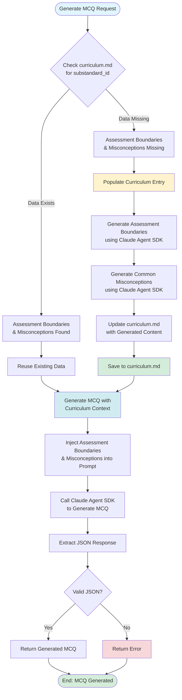

# Option C Workflow: Curriculum Population & MCQ Generation

## Overview

When generating an MCQ, the system needs curriculum context to create a good question. This workflow makes sure that context exists before generation starts, and reuses it for all future questions about the same standard.

## Workflow Diagram



## Two-Phase Process

### Phase 1: Curriculum Population

Before generating any question, we check whether the curriculum file already has assessment boundaries and misconceptions for the requested standard. If those fields are empty (marked as `*None specified*`), we generate them using Claude and save them to the file.

The generation happens automatically - you don't need to do anything special. The first time you request an MCQ for a standard, it might take a bit longer because it's generating the curriculum data. But once that data exists, all future requests for the same standard will reuse it immediately.

### Phase 2: MCQ Generation

With curriculum data guaranteed to exist (either from the file or freshly generated), we look it up and include it in the prompt to Claude. The assessment boundaries tell Claude what's in scope and what's not, while the misconceptions provide specific student errors to use when crafting distractors.

This context makes the generated questions more accurate and more useful. Instead of guessing what might be wrong, the distractors reflect actual patterns of student misunderstanding.

## Benefits

This approach gives us several advantages:

- **Consistency**: Every question for the same standard uses identical curriculum context, so you get predictable quality
- **Efficiency**: We only generate curriculum data once per standard, then reuse it for all future questions
- **Quality**: Questions are better aligned with educational standards because they're constrained by explicit boundaries
- **Automatic**: The whole process happens without any manual steps - just request an MCQ and it works

## Example Flow

Here's what happens when you request an MCQ:

**First Request (Standard Not Yet Populated):**

```
Request: Generate MCQ for CCSS.ELA-LITERACY.L.3.1.A

Step 1: Check curriculum.md
  → Assessment Boundaries: *None specified*
  → Common Misconceptions: *None specified*
  → Need to populate!

Step 2: Populate (first time)
  → Generate Assessment Boundaries using Claude
  → Generate Common Misconceptions using Claude
  → Update curriculum.md with the generated content

Step 3: Generate MCQ
  → Use the newly populated boundaries and misconceptions
  → Create question that aligns with boundaries
  → Create distractors based on misconceptions
```

**Second Request (Standard Already Populated):**

```
Request: Generate MCQ for CCSS.ELA-LITERACY.L.3.1.A (again)

Step 1: Check curriculum.md
  → Assessment Boundaries: Assessment should focus on... (exists!)
  → Common Misconceptions: * Students may confuse... (exists!)
  → Reuse existing data!

Step 2: Generate MCQ
  → Use existing boundaries and misconceptions
  → No regeneration needed - much faster!
```

## File Updates

The `curriculum.md` file is updated in-place:

**Before:**
```
Assessment Boundaries:
*None specified*

Common Misconceptions:
*None specified*
```

**After:**
```
Assessment Boundaries:
Assessment should focus on identifying and explaining the function of basic parts of speech in simple sentences. Assessment is restricted to:
- Sentences with clear, grade-3 appropriate vocabulary
- Single-clause sentences (no complex sentence structures)
...

Common Misconceptions:
* Students may confuse adjectives with adverbs, thinking any descriptive word is an adjective
* Students often think that all words ending in -ly are adverbs
* Students may believe that the position of a word determines its part of speech
...
```

## Implementation Details

### Key Functions

**`populate_curriculum_entry()`**
- Checks if curriculum data already exists for a standard
- If missing, generates it using Claude
- Updates the curriculum file with the new content
- Returns the generated or existing data

**`update_curriculum_file()`**
- Parses the curriculum file to find the matching standard entry
- Replaces `*None specified*` placeholders with generated content
- Preserves the file structure and formatting

**`generate_one_agent_sdk()`**
- Calls `populate_curriculum_entry()` first to ensure data exists
- Then uses the populated data to generate the MCQ

## Usage

The population happens automatically - you don't need to do anything special. Just call the generation function as normal:

```python
result = await generate_one_agent_sdk(request, curriculum_path=path)
```

The pipeline automatically handles checking if data exists, populating it if missing, and using it for generation. You get consistent, curriculum-grounded questions without any extra work.
